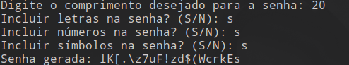

# Gerador de Senhas



## Descrição
Um programa em Python que gera senhas aleatórias com base nas preferências do usuário. Ele oferece flexibilidade para escolher o comprimento da senha e quais tipos de caracteres incluir, como letras, números e símbolos.

## Funcionalidades
- Gera senhas aleatórias com base nas preferências do usuário.
- Permite personalizar o comprimento da senha.
- Opção de inclusão de letras maiúsculas e minúsculas, números e símbolos.
- Utiliza a biblioteca `random` do Python para a geração aleatória de caracteres.

## Requisitos
- Python 3.x

## Como Usar
1. Faça o download ou clone este repositório.
2. Navegue até o diretório do projeto.
3. Execute o programa executando o seguinte comando no terminal:
    ```shell
    python3 gerador.py
    ```
4. Siga as instruções exibidas no terminal para selecionar as preferências da senha.
5. Após fornecer as preferências, a senha gerada será exibida no terminal.

## Personalização
Você pode personalizar o comportamento do gerador de senhas modificando as seguintes opções:
- `comprimento`: Altere o valor padrão do comprimento da senha na função `solicitar_comprimento()`.
- `incluir_letras`, `incluir_numeros`, `incluir_simbolos`: Modifique as opções padrão de inclusão de letras, números e símbolos na função `obter_preferencias()`.


## Contribuição
Contribuições são bem-vindas! Sinta-se à vontade para enviar sugestões, correções de bugs ou melhorias por meio de pull requests.


